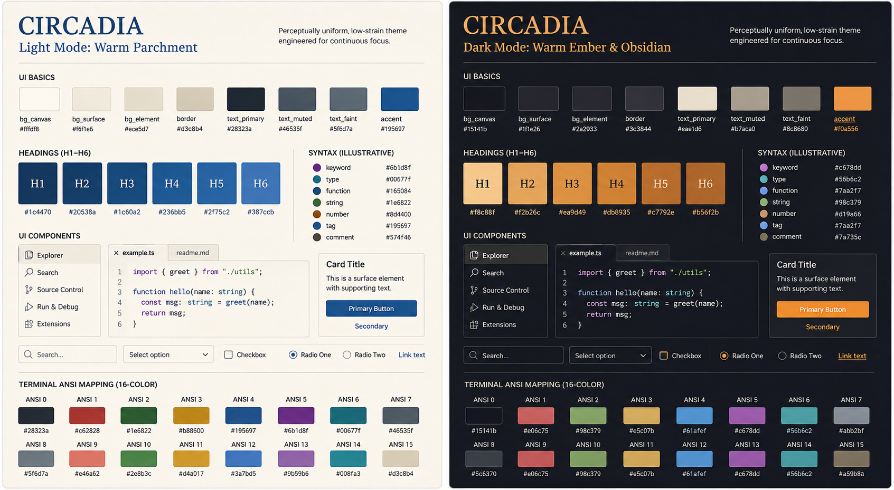

# Circadia

> **Perceptually uniform, low-strain themes engineered for continuous focus.**

Circadia is an open color specification engineered in OKLCH for cross-platform editors, document renderers, and terminal tools. Built around circadian light science, it delivers glare-free daylight contrast (Warm Parchment) and halation-free evening warmth (Warm Ember & Obsidian)—strictly maintaining WCAG 2.1 AAA legibility for long coding and writing sessions.



---

## 🎨 Palette Overview

| Mode                               | Environment      | Target Lux   | Canvas Background                    | Primary Foreground                   | Primary Accent                       |
| :--------------------------------- | :--------------- | :----------- | :----------------------------------- | :----------------------------------- | :----------------------------------- |
| **Light** (`Warm Parchment`)       | Bright ambient   | 300–800+ lux | `#fffdf8` (`oklch(99.2% 0.007 85)`)  | `#28323a` (`oklch(30.0% 0.020 250)`) | `#195697` (`oklch(44.0% 0.120 250)`) |
| **Dark** (`Warm Ember & Obsidian`) | Low light / dark | 0–50 lux     | `#15141b` (`oklch(19.0% 0.012 290)`) | `#eae3d8` (`oklch(91.0% 0.015 85)`)  | `#e89a49` (`oklch(75.0% 0.130 65)`)  |

---

## 📁 Repository Structure

```
├── .github/
│   └── ISSUE_TEMPLATE/
│       ├── port-request.md         # Template for community port requests
│       └── bug-report.md           # Template for bug reports
│
├── spec/                           # The Single Source of Truth
│   ├── palette.json                # Raw OKLCH + Hex values for Light & Dark modes
│   ├── rules.md                    # Contrast & accessibility invariants (AAA rules)
│   └── token-map.md                # Mapping guide (e.g. Editor Cursor, Search Highlight)
│
├── ports/                          # Community & official theme configs
│   ├── alacritty/                  # Alacritty terminal TOML (Light & Dark)
│   ├── chrome/                     # Google Chrome theme manifests (Light & Dark)
│   ├── intellij/                   # JetBrains IDE color schemes (Light & Dark)
│   ├── iterm2/                     # iTerm2 color presets (Light & Dark)
│   ├── kde/                        # KDE Plasma color schemes (Light & Dark)
│   ├── kitty/                      # Kitty terminal conf (Light & Dark)
│   ├── konsole/                    # KDE Konsole color schemes (Light & Dark)
│   ├── neovim/                     # Neovim / Lua plugin (Light & Dark)
│   ├── obsidian/                   # Obsidian theme CSS (Light & Dark)
│   ├── slack/                      # Slack custom color themes (Light & Dark)
│   ├── tailwind/                   # Tailwind CSS v4 @theme design tokens
│   ├── telegram/                   # Telegram Desktop themes (Light & Dark)
│   ├── vim/                        # Classic Vim colorschemes (Light & Dark)
│   ├── vitepress/                  # VitePress theme CSS variables (Light & Dark)
│   ├── vscode/                     # Visual Studio Code extension (Light & Dark)
│   ├── windows-terminal/           # Windows Terminal JSON schemes (Light & Dark)
│   ├── xcode/                      # Apple Xcode theme plists (Light & Dark)
│   └── zed/                        # Zed Editor theme extension (Light & Dark)
│
├── scripts/                        # Automation & Generation
│   ├── validate.ts                 # Validates contrast ratios & checks for broken hexes
│   ├── generate-formats.ts         # Generates dist/ raw tables (Hex, RGB, HSL, OKLCH)
│   └── build-all-ports.js          # Builds & updates theme files across all ports
│
├── dist/                           # Generated exports for third-party builders
│   ├── palette.json                # Flattened multi-format export
│   └── palette.csv                 # Tabular CSV export
│
├── assets/                         # Visuals for README & port authors
│   ├── preview-day.png
│   ├── preview-night.png
│   └── swatch-matrix.png
│
├── CONTRIBUTING.md                 # Step-by-step guide for creating a new port
├── LICENSE
└── README.md                       # Palette overview, port table, status
```

---

## 🚀 Supported Ports & Status

| Application          | Port Path                                           | Modes Supported | Type               |
| :------------------- | :-------------------------------------------------- | :-------------- | :----------------- |
| **VS Code**          | [`ports/vscode/`](ports/vscode)                     | Light, Dark     | Theme Extension    |
| **Neovim**           | [`ports/neovim/`](ports/neovim)                     | Light, Dark     | Lua Plugin         |
| **Vim**              | [`ports/vim/`](ports/vim)                           | Light, Dark     | Vim Plugin         |
| **Zed**              | [`ports/zed/`](ports/zed)                           | Light, Dark     | Theme Extension    |
| **JetBrains IDEs**   | [`ports/intellij/`](ports/intellij)                 | Light, Dark     | ICLS Scheme        |
| **Xcode**            | [`ports/xcode/`](ports/xcode)                       | Light, Dark     | Xcode Theme Plist  |
| **Obsidian**         | [`ports/obsidian/`](ports/obsidian)                 | Light, Dark     | CSS Theme          |
| **Alacritty**        | [`ports/alacritty/`](ports/alacritty)               | Light, Dark     | TOML Configs       |
| **Kitty**            | [`ports/kitty/`](ports/kitty)                       | Light, Dark     | Conf Files         |
| **iTerm2**           | [`ports/iterm2/`](ports/iterm2)                     | Light, Dark     | Color Presets      |
| **Konsole**          | [`ports/konsole/`](ports/konsole)                   | Light, Dark     | Color Scheme       |
| **Windows Terminal** | [`ports/windows-terminal/`](ports/windows-terminal) | Light, Dark     | Color Schemes JSON |
| **Google Chrome**    | [`ports/chrome/`](ports/chrome)                     | Light, Dark     | Browser Theme      |
| **Telegram Desktop** | [`ports/telegram/`](ports/telegram)                 | Light, Dark     | Palette Files      |
| **Slack**            | [`ports/slack/`](ports/slack)                       | Light, Dark     | Color Strings      |
| **KDE Plasma**       | [`ports/kde/`](ports/kde)                           | Light, Dark     | Color Scheme       |
| **Tailwind CSS**     | [`ports/tailwind/`](ports/tailwind)                 | Light, Dark     | CSS @theme Tokens  |
| **VitePress**        | [`ports/vitepress/`](ports/vitepress)               | Light, Dark     | CSS Theme Styles   |

---

## 🛠️ Tooling & Validation

```bash
# 1. Run contrast & format validation against spec/
npm run validate

# 2. Regenerate dist/palette.json and dist/palette.csv
npm run generate

# 3. Rebuild all theme ports from the single-source spec
npm run build:ports
```

---

## 🤝 Community Contribution Flow

- Want a port for your favorite editor, terminal, or shell? Check [`CONTRIBUTING.md`](CONTRIBUTING.md) or open a [Port Request](.github/ISSUE_TEMPLATE/port-request.md).
- Contributors submit PRs adding a new folder inside `ports/<app-name>/`.
- If a port grows significantly (e.g. standalone marketplace extension), it can be spun out into its own repository and linked from here.

---

## 📜 License

[MIT](LICENSE)
