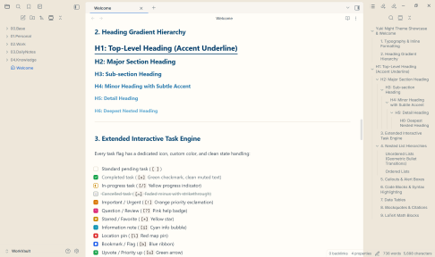

# Circadia

> **Warm Parchment by day. Quiet Ember & Obsidian by night.**  
> An OKLCH theme for writing, note-taking, and code reading.

---

## Color model

Circadia uses OKLCH to describe lightness, chroma, and hue. Contrast is calculated from the rendered sRGB colors. The color model alone does not guarantee readability, physiological comfort, or CVD separation. See the main README for validation coverage.

## Color roles

Dark variants share neutral text and headings, blue links, sage controls, and a common syntax palette. Their canvas and surface colors retain each variant’s identity.

| Role | Light | All dark variants |
| --- | --- | --- |
| Body text | `#28323a` | `#cbc9c4` |
| Secondary text | `#394652` | `#bdbab3` |
| Metadata | `#3e4750` | `#b8b4ac` |
| Links | `#003fa0` | `#9fc5d2` |
| Active controls | `#003fa0` | `#a5c3a4` |

| Heading | Light | All dark variants |
| --- | --- | --- |
| H1 | `#0d2a46` | `#d4d3cf` |
| H2 | `#0d2f50` | `#cecdc9` |
| H3 | `#0e355b` | `#c8c7c3` |
| H4 | `#0f3a66` | `#c2c1bd` |
| H5 | `#134073` | `#bcbbb7` |
| H6 | `#15477e` | `#b6b5b1` |

The base palette text pairs meet 7:1. Plugin styles and other rendered states require separate checks.

## ✨ Features

- **Dual-Mode Ergonomics:** Seamless transition between daylight reading and night circadian preservation.
- **Underlined Tab Navigation:** Clean, modern editor tab bar with active accent underline.
- **Direct SVG Checklist Flags:** 14 distinct task states (`[x]`, `[/]`, `[-]`, `[!]`, `[?]`, `[*]`, `[i]`, etc.).
- **Minimalist Clean Borders:** Zero heavy shadows; 1px precision dividers.
- **Accurate Zero-Drift Typography:** Powered by `Lexend` & `Inter` system stack.
- **Full Callout Engine:** Semantic color borders with zero contrast collisions.

---

## 🌓 Selecting Dark Variations (Ember, Plum, Forest)

Circadia 2.0 provides 3 distinct dark variations for Obsidian:
* **Warm Ember & Espresso (Dark Classic)**: Warm candlelight charcoal (`#17130f`) [Default]
* **Plum Noir (Dark Modern)**: Velvet wine noir canvas (`#140e12`) with vibrant pastel syntax
* **Obsidian Pine (Dark Focus)**: Restorative obsidian evergreen moss (`#131714`)

### Method 1: Using the "Style Settings" Plugin (Recommended)
1. In Obsidian, install the **Style Settings** community plugin (**Settings → Community plugins → Browse → Style Settings**).
2. Go to **Settings → Style Settings → Circadia Theme**.
3. Under **Dark Theme Flavour**, select your preferred night atmosphere:
   - *Warm Ember & Espresso (Dark Classic)*
   - *Plum Noir (Dark Modern)*
   - *Obsidian Pine (Dark Focus)*

### Method 2: Using CSS Snippets (Zero Plugins Required)
1. Open your vault's `.obsidian/snippets/` folder.
2. Copy either [`snippets/circadia-dark-plum.css`](snippets/circadia-dark-plum.css) or [`snippets/circadia-dark-forest.css`](snippets/circadia-dark-forest.css) into that folder.
3. Open Obsidian **Settings → Appearance → CSS Snippets**, click the refresh icon, and toggle on your chosen snippet.

---

## 🚀 Installation

### In Obsidian:
1. Open **Settings → Appearance → Themes**
2. Click **Manage**
3. Search for **Circadia** (or clone/copy this folder to `<vault>/.obsidian/themes/Circadia/`)
4. Enable the theme and use Circadia.

---

## 📜 License

MIT © [Tanmay](https://github.com/tanmaymanojgandhi)
